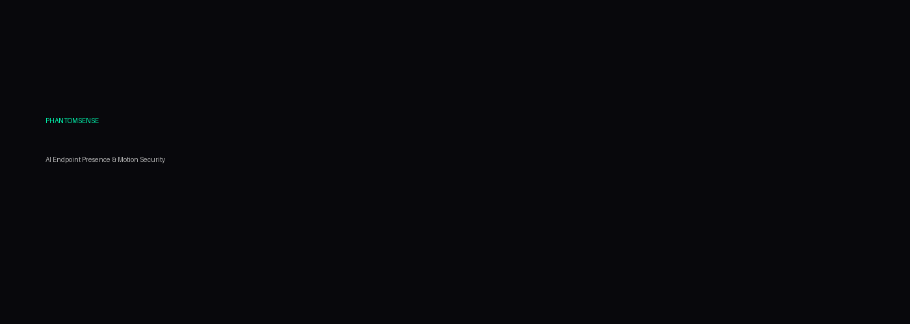

# PhantomSense

<p align="center">
  
</p>

<h1 align="center">PhantomSense</h1>

<p align="center">
AI-Powered Endpoint Presence & Motion Security System
</p>

<p align="center">
Situational Awareness · Device Integrity · Behavioral Detection · Executive Protection
</p>

---

## Overview

PhantomSense is a cinematic-style cybersecurity monitoring platform designed to provide real-time environmental awareness around endpoints.

The system combines:
- motion detection
- webcam-based presence analysis
- behavioral anomaly monitoring
- device tamper awareness
- ambient threat monitoring

to create a lightweight AI-powered defensive perimeter around laptops and workstations.

Designed for:
- executives
- security researchers
- remote workers
- SOC environments
- high-risk travel scenarios
- sensitive operational environments

---

## Features

| Capability | Description |
|---|---|
| Motion Detection | Detects movement near protected devices |
| Presence Awareness | Identifies nearby human presence |
| Device Tamper Alerts | Detects unauthorized movement |
| Webcam Integrity | Flags obstruction/spoof attempts |
| Silent Security Mode | Covert background monitoring |
| Executive Travel Mode | Elevated public-space monitoring |
| Behavioral Baselines | Learns normal usage patterns |
| Local AI Processing | No cloud dependency |
| Threat Event Logging | Structured forensic timeline |

---

## Architecture

```text
              ┌─────────────────────────────┐
              │      Device Sensors         │
              │ Webcam · Audio · Telemetry  │
              └────────────┬────────────────┘
                           │
                ┌──────────▼──────────┐
                │   PhantomSense AI   │
                │ Presence Analysis   │
                │ Motion Correlation  │
                │ Behavioral Engine   │
                └──────────┬──────────┘
                           │
         ┌─────────────────┼─────────────────┐
         │                 │                 │
 ┌───────▼──────┐ ┌────────▼────────┐ ┌──────▼──────┐
 │ Threat Alerts │ │ Security Events │ │ Risk Engine │
 │ Silent Mode   │ │ Timeline Logs   │ │ Risk Scores │
 └────────────────┘ └─────────────────┘ └─────────────┘
```

---

## Demo

```bash
python src/main.py
```

System output:

```text
[ PhantomSense ]
Monitoring active...

[ MOTION DETECTED ]
Unknown movement identified near protected device
Risk Score: 84.2
```

---

## Tech Stack

- Python
- OpenCV
- FastAPI
- NumPy
- ONNX Runtime
- Local AI Inference
- Structured Event Logging

---

## Security Philosophy

Traditional endpoint protection focuses on software threats.

PhantomSense extends visibility into the physical and behavioral layer around a device.

The objective is not surveillance.
The objective is situational awareness and defensive monitoring.

---

## Roadmap

- [x] Motion Detection Engine
- [x] Device Tamper Monitoring
- [x] Threat Event Logging
- [ ] AI Behavioral Profiling
- [ ] Multi-device Mesh Monitoring
- [ ] Executive Protection Dashboard
- [ ] Mobile Companion App
- [ ] Real-time Threat Correlation

---

## Disclaimer

PhantomSense is intended for defensive security research, endpoint awareness, and authorized monitoring only.

---

## License

MIT License
